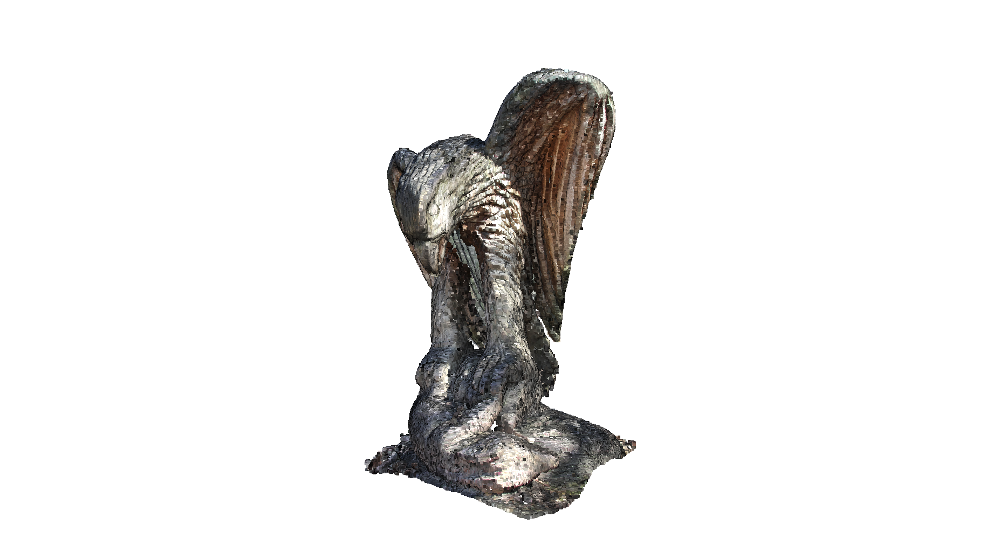
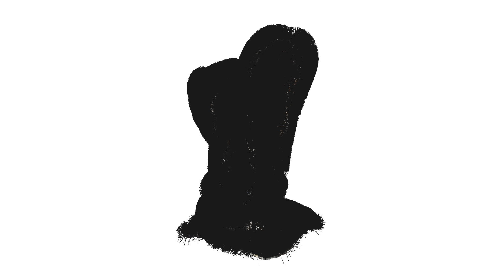
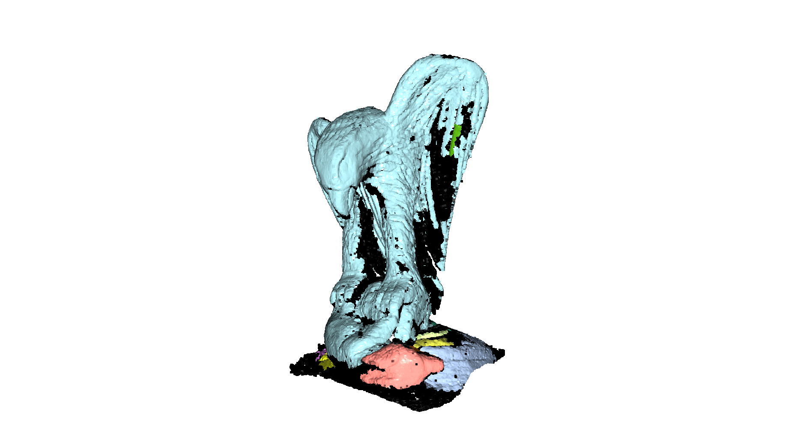

# augmentus_assignment

[UML Diagram](docs/pcp_pipeline.md)

## Installation and Setup

This project requires Python 3.8+ and uses a virtual environment for dependency management.

### Prerequisites

1. Create Virtual Environment (venv):

```bash
$ python3 -m venv venv_open3d
$ source venv_open3d/bin/activate
```

2. Install Dependencies:

```bash
(venv_open3d) pip install -r requirements.txt
```

## Usage

The core workflow is executed via the run_eagle_pipeline.py script.

### Run the main pipeline script from the project root

```bash
(venv_open3d) python -m pcp.run_eagle_pipeline
```

The pipeline uses the Open3D interactive viewer to display results sequentially. User interaction is required to advance the processing stages:

View and Save: For each stage (Downsampled, Normals, Clustered), a new window will open. You can rotate the model using the mouse. To save the view as an image file, press the P key on your keyboard while the window is active.

Advance Stage: To move to the next processing step, you must manually close the current visualization window.

#### Visualized Stages (Sequential):

1. Downsampled Point Cloud



2. Point Cloud with Estimated Normals



3. Clustered Point Cloud



## Testing and Code Quality

The project utilizes Pytest for a comprehensive testing suite that includes functionality checks, regression testing, and linting.

### Code Formatting

The codebase adheres to strict style standards enforced by Black and isort.

To format the entire project, run:

```bash
(venv_open3d) black .
(venv_open3d) isort .
```

### Running Tests

Run the following command from the project root to execute the entire test suite:

```bash
(venv_open3d) pytest
```

The test suite performs the following actions:

1. Downsampling Reduction: Verifies that Voxel Down-sampling successfully reduces the point count while remaining non-zero.

2. Normal Creation: Asserts that the NormalEstimator creates a normals array with the correct (N x 3) dimensionality.

3. Clustering Segmentation: Confirms that the resulting clusters count is greater than one, achieving geometric separation.

4. Clustering Regression: Asserts that the size of the largest segmented cluster remains stable against a known "Golden Standard" value (within 1% tolerance).

5. Empty Input (Processor/Normal Estimation/Clustering): Verifies that passing an empty point cloud to them does not crash and returns zero points/clusters.

The test suite performs three actions:

1. Linting (Flake8): Checks all Python source files for PEP 8 style violations.

2. Unit Tests: Verifies core functionality, such as ensuring Voxel Down-sampling correctly reduces the point count and clustering produces multiple segments.

3. Regression Test: Compares the size of the largest cluster against a known Golden Standard value to ensure stability against code changes.

## Documentation

The project's API reference are generated automatically from docstrings using Sphinx.

1. Navigate to the documentation directory:

```bash
(venv_open3d) cd docs
```

2. Build the HTML documentation:

```bash
(venv_open3d) make html
```

Open _build/html/index.html in your web browser. This includes the API reference for all classes.