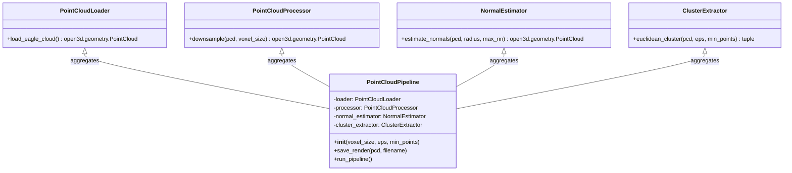
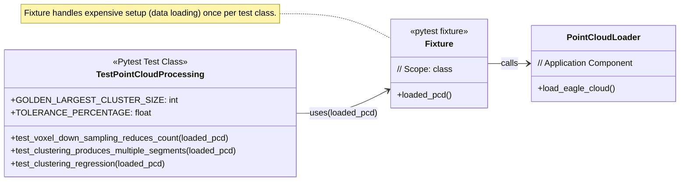

# UML Class Diagram for Point Cloud Pipeline

* `PointCloudLoader`: Responsible solely for retrieving the dataset.
* `PointCloudProcessor`: Handles generic preprocessing (like downsampling).
* `NormalEstimator`: Calculates surface geometry properties.
* `ClusterExtractor`: Executes the segmentation algorithm.
* `PointCloudPipeline`: The primary orchestrator of the application. It manages the sequence of operations (Load -> Process -> Normals -> Cluster -> Render) and holds the configuration parameters.

# UML Class Diagram for Pytest Architecture

* `Fixture (loaded_pcd)`: Acts as the setup/teardown utility for the entire test class.
* `TestPointCloudProcessing`: The main container for all unit and regression test methods.

